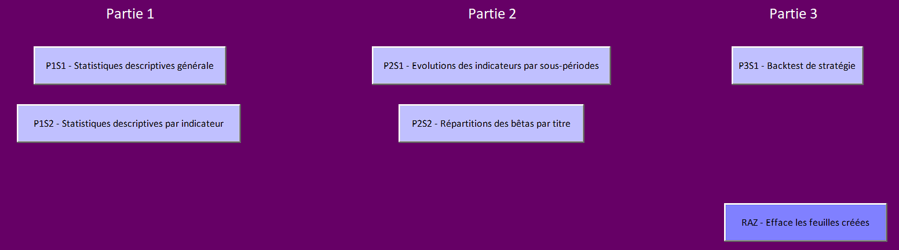
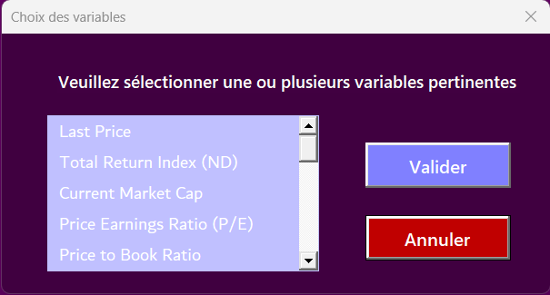
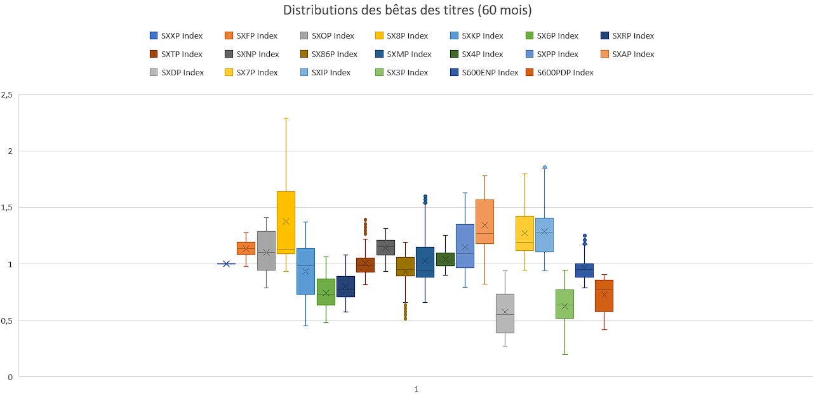

# Market Data Collector and Analyzer in VBA

This advanced VBA project provides a suite of tools integrated into Excel for collecting, analyzing, and backtesting market data. Featuring a user-friendly interface with several buttons, users can access a range of functionalities to obtain detailed statistics, visualize indicator trends, and execute customizable backtesting strategies.

## Features

### Part 1: Destructive Statistics and Indicator Analysis

**Macro Launch**: A button initiates a macro that generates destructive statistics, offering an initial overview of the data count per indicator.
Indicator-Specific Visualization: After obtaining a global overview, it's possible to select specific indicators for more detailed analysis. An image of the output is displayed for each chosen indicator.

### Part 2: Tracking Indicator Evolution

**Temporal Analysis**: This section enables the separation of index performances by period and also facilitates the calculation of their rolling beta. It allows users to visualize the evolution of various indicators over defined sub-periods, enhancing analysis with the option to include graphical visualizations for each distinct period. This feature provides a deeper insight into the behavior of each index over time, offering valuable data for more informed decision-making.

### Part 3: Strategy Backtesting

This section of the tool is dedicated to setting up and running backtests on investment strategies using a comprehensive and interactive configuration interface. Below is a breakdown of the adjustable parameters that users can manipulate to tailor their backtesting scenarios:

**Investment Sector Selection**: This feature allows users to precisely select the investment sector or subsector for conducting zero-investment portfolio analysis. The dropdown menu provides a list of diverse market segments, including but not limited to:

Each sector or subsector listed comes with an associated number, possibly indicating the number of available securities or data points within that category. Users can select one or multiple sectors to focus their backtesting efforts on particular areas of the market. This granularity enables a tailored analysis that can reflect the performance of specific industries and their unique characteristics, giving users the flexibility to simulate investment strategies across different market environments.

**Start and End Date**: Users can define the time frame for the backtest by choosing the start and end dates, which provides control over the historical period for analysis.

**Evaluation Variable**: Offers an option to select the basis of evaluation for the backtesting:

*Last Price: May be used to evaluate portfolio performance based on the final trading price of assets.*
*Total Return: Allows assessment based on the total return, factoring in dividends and other earnings.*

Sorting Variables for 'Long' Portfolio: Enables users to select and order variables in ascending order for constructing a 'Long' portfolio, which can include factors like:

*Price metrics (e.g., last price)*
*Return indexes (e.g., total return index net of dividends)*
*Market capitalization*
*Valuation ratios (e.g., price to earnings, book, sales, EBITDA ratios)*

Sorting Variables for 'Short' Portfolio: Similar to the 'Long' portfolio, but variables are ordered in descending order for constructing a 'Short' portfolio.

**Number of Titles in Portfolio**: Defines the number of securities to be included in the portfolio, with a minimum set, which can affect the diversification and risk profile of the backtested strategy.

**Investment Amount in the Market for Each Portfolio**: Specifies the monetary amount to be virtually invested in each portfolio, providing a scale to the investment strategy being tested.

**Portfolio Holding Period Choice**: Allows the user to set the holding period for the portfolio in months, which is critical for determining the investment horizon for the backtesting.

The combination of these parameters offers a dynamic and customizable backtesting environment, empowering users to simulate investment strategies with precision and to analyze the historical performance of those strategies under various conditions and assumptions. The interface is designed to be intuitive, allowing for both novice and experienced investors to engage with the tool effectively.

## Installation and Configuration

Download the Excel workbook of the project from this GitHub repository.
Open the workbook with Excel. Enable macros to allow the execution of the VBA code.
Explore the different functionalities through the buttons and instructions provided in each sheet.

## Usage
Specific documentation is available for each feature:
Statistics and Analysis: Refer to the attached PDFs for detailed instructions on visualizing and analyzing indicators.
Backtesting: Examples of strategy configuration and optimization are included to guide users through the backtesting process.
